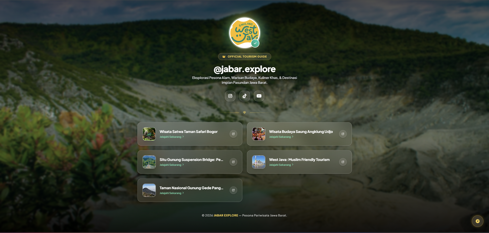

# Project Bio-Link: Jabar Explore

Proyek ini adalah sistem manajemen tautan (Bio-Link) sederhana yang dibangun menggunakan Laravel dan Tailwind CSS. Proyek ini mencakup halaman Admin untuk mengelola tautan (tambah, edit, hapus, unggah gambar/ikon) dan Halaman Publik untuk menampilkan daftar tautan tersebut.

## 👨‍💻 Identitas Mahasiswa

- **Nama Lengkap:**+ Muhammad Hafizh Akbar Solehuidn 
- **NIM:** 2430511012
- **Kelompok:** 3

---

## 📸 Tangkapan Layar (Screenshot) Halaman Publik

Berikut adalah hasil akhir dari kustomisasi Halaman Publik Bio-Link:



*(Catatan: Pastikan file gambar screenshot Anda diunggah ke GitHub dengan nama `screenshot-publik.png` dan diletakkan di folder yang sama dengan file README.md ini, atau ubah nama file di atas sesuai dengan nama file screenshot Anda).*

---

## 🚀 Cara Menjalankan Proyek Secara Lokal

1. Clone repositori ini:
   ```bash
   git clone [URL_REPOSITORI_ANDA]